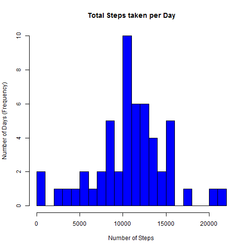
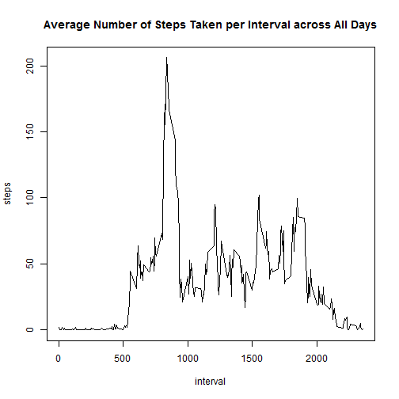
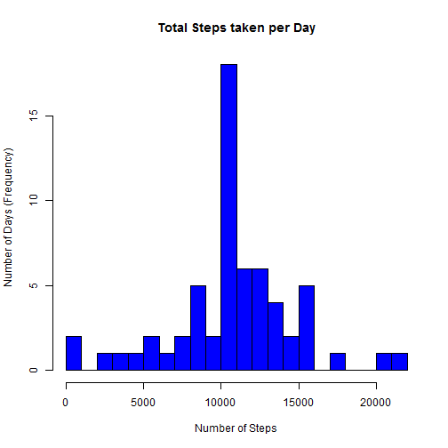

## Loading and preprocessing the data

```r
data<-read.csv(file="activity.csv",header=TRUE)
```

## What is mean total number of steps taken per day?

```r
dataclean<-na.omit(data)
data_sum<-aggregate(steps~date,dataclean,sum)
hist(data_sum$steps,breaks=20,col="blue",xlab="Number of Steps",ylab="Number of Days (Frequency)",main="Total Steps taken per Day")
```

 

```r
mean(data_sum$steps)
```

```
## [1] 10766.19
```

```r
median(data_sum$steps)
```

```
## [1] 10765
```

## What is the average daily activity pattern?

```r
mean_interval<-aggregate(steps~interval,dataclean,mean)
with(mean_interval,plot(interval,steps,type="l",main="Average Number of Steps Taken per Interval across All Days"))
```

 

```r
subset(mean_interval,steps==max(mean_interval$steps))
```

```
##     interval    steps
## 104      835 206.1698
```

## Imputing missing values

```r
sum(is.na(data$steps))
```

```
## [1] 2304
```

```r
sum(is.na(data$steps))/nrow(data)
```

```
## [1] 0.1311475
```

```r
data_missing<-subset(data,is.na(steps)==TRUE)
merged<-merge(mean_interval,data_missing,by="interval")
merged$steps.y<-NULL
colnames(merged)[colnames(merged)=="steps.x"]<-"steps"
data_filled<-rbind(dataclean,merged)

data_sum2<-aggregate(steps~date,data_filled,sum)
hist(data_sum2$steps,breaks=20,col="blue",xlab="Number of Steps",ylab="Number of Days (Frequency)",main="Total Steps taken per Day")
```

 

```r
mean(data_sum2$steps)
```

```
## [1] 10766.19
```

```r
median(data_sum2$steps)
```

```
## [1] 10766.19
```

## Are there differences in activity patterns between weekdays and weekends?

```r
data_filled<-transform(data_filled,date=strptime(date,"%Y-%m-%d"))
data_filled$weekday<-"weekday"
for (i in (1:nrow(data_filled))) {
  if (weekdays(data_filled[i,]$date) %in% c("Saturday","Sunday")) {
    data_filled[i,]$weekday<-"weekend"}
  else {
    data_filled[i,]$weekday<-"weekday"}
}
data_filled<-transform(data_filled,weekday=factor(weekday))
mean_interval2<-aggregate(steps~interval+weekday,data_filled,mean)
library(lattice)
xyplot(steps~interval | weekday, data=mean_interval2, layout = c(1, 2),type="l")
```

 
